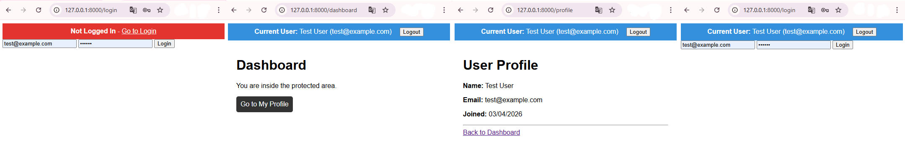

## A. crear proyecto
1. creamos un nuevo proyecto `a1-example` en la carpeta `Laravel_repo` 
2. modificamos las variables de entorno 
3. comentamos las tablas cache y jobs dejando users
4. migramos y creamos un usuario con tinker.
```ini
DB_CONNECTION=pgsql
DB_HOST=127.0.0.1
DB_PORT=5432
DB_DATABASE=a1_example
DB_USERNAME=postgres
DB_PASSWORD=root
```
```bash
laravel new a1-example
cd a1-example
code .
php artisan migrate
php artisan tinker
App\Models\User::create([
    'name' => 'Test User',
    'email' => 'test@example.com',
    'password' => Hash::make('123456')
]);
```

## B. Login basico
1. en el enrutador colocamos
2. creamos la vista `login.blade.php`
```php
use Illuminate\Support\Facades\Route;
use Illuminate\Http\Request;
use Illuminate\Support\Facades\Auth;

Route::get('login', function () { return view('login'); })->name('login');

Route::post('login', function (Request $request) {
    $credentials = $request->only('email', 'password');

    if (Auth::attempt($credentials)) {
        $request->session()->regenerate();
        return redirect()->intended('dashboard');
    }

    return back()->withErrors(['email' => 'Invalid credentials']);
});

Route::get('dashboard', function () {
    return "Hello " . Auth::user()->name . ". You are logged in!";
})->middleware('auth');

//--------------------------------------------------------------------------------

<form method="POST" action="/login">
    @csrf
    <input type="email" name="email" placeholder="Email" required>
    <input type="password" name="password" placeholder="Password" required>
    <button type="submit">Login</button>
</form>

@if($errors->any())
    <p>{{ $errors->first() }}</p>
@endif

```

## C. Login / Logout y barra de seccion actual
1. creamos un componente en `views/components/user-bar.blade.php`
2. creamos `dashboard.blade.php` y `profile.blade.php`
3. modificamos route
```php
Route::middleware(['auth'])->group(function () {
    Route::get('dashboard', function () {return view('dashboard');});
    Route::get('profile', function () {return view('profile');})->name('profile');
});

//--------------------------------------------------------------------------------
@auth
    <div style="background: #3490dc; color: white; padding: 10px; text-align: center; font-family: sans-serif;">
        <strong>Current User:</strong> {{ Auth::user()->name }} ({{ Auth::user()->email }})
        
        <form action="{{ route('logout') }}" method="POST" style="display: inline; margin-left: 15px;">
            @csrf
            <button type="submit" style="cursor: pointer;">Logout</button>
        </form>
    </div>
@endauth

@guest
    <div style="background: #e3342f; color: white; padding: 10px; text-align: center; font-family: sans-serif;">
        <strong>Not Logged In</strong> - <a href="/login" style="color: white;">Go to Login</a>
    </div>
@endguest
//--------------------------------------------------------------------------------
@include('components.user-bar')

<div style="padding: 20px; font-family: sans-serif;">
    <h1>Dashboard</h1>
    <p>You are inside the protected area.</p>
    
    <!-- This link leads to your new view -->
    <a href="{{ route('profile') }}" style="display: inline-block; padding: 10px; background: #333; color: white; text-decoration: none; border-radius: 5px;">
        Go to My Profile
    </a>
</div>
//--------------------------------------------------------------------------------
@include('components.user-bar')

<div style="padding: 20px; font-family: sans-serif;">
    <h1>User Profile</h1>
    <p><strong>Name:</strong> {{ Auth::user()->name }}</p>
    <p><strong>Email:</strong> {{ Auth::user()->email }}</p>
    <p><strong>Joined:</strong> {{ Auth::user()->created_at->format('d/m/Y') }}</p>
    
    <hr>
    <a href="/dashboard">Back to Dashboard</a>
</div>
```
* @auth -> El usuario está logueado.	Áreas privadas, perfil, logout.
* @guest -> El usuario no está logueado.	Login, registro, landing pages para nuevos usuarios.
tambie se puede 
```php
@auth
    <!-- Contenido para usuarios logueados -->
@else
    <!-- Contenido para visitantes -->
@endauth
```
tambien se puede hacer de esta manera
```php
return back()->withErrors([' ..error name.. ' => 'Invalid credentials']);
@error(' ..error name.. ')
    <span style="color: red;">{{ $message }}</span>
@enderror
```



## C. agregar columnas a usuario inicio de sesion con username
1. agregaremos a la tabla usuario